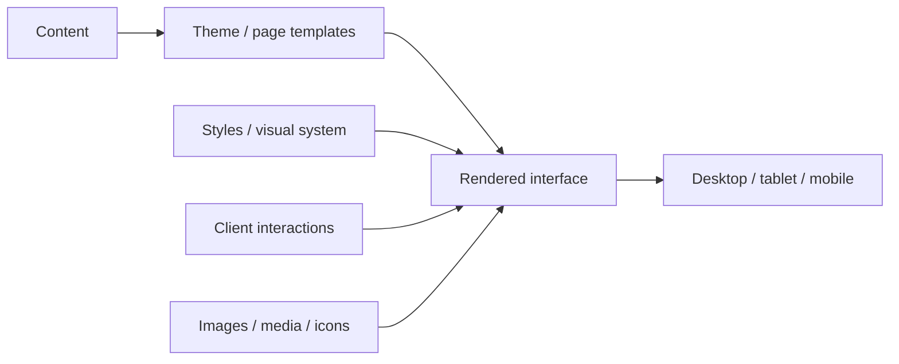
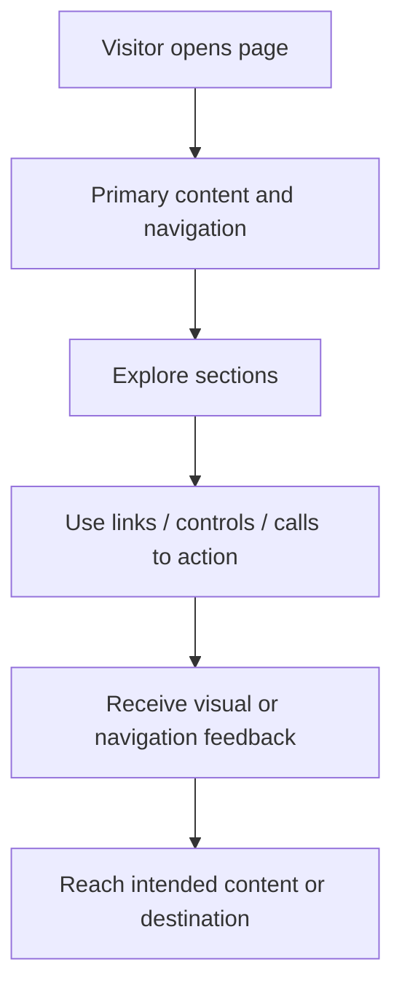
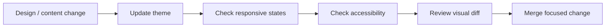

<div align="center">

# bestdesign

**A web-theme and interface design repository focused on reusable presentation, layout, styling, and front-end experience work.**


[Browse theme](./theme) · [Issues](https://github.com/Nischhalsubba/bestdesign/issues)

</div>

## Overview

**bestdesign** collects the maintained theme implementation inside `theme/`. The repository is documented so developers can find the implementation quickly, designers can understand the visual system, and non-technical reviewers can follow how a page moves from content to rendered experience.

| Audience | Start with |
|---|---|
| Developers | Theme structure, templates, styles, scripts, assets |
| Designers | Visual hierarchy, responsive behavior, states, accessibility |
| Product / content | Page purpose, content structure, navigation, SEO |
| Reviewers | Architecture and experience flow below |

<details open>
<summary><strong>🏗️ Interactive theme architecture</strong></summary>



</details>

## Experience flow



## Repository map

- [`theme/`](./theme) — maintained theme and interface implementation.
- [`.github/`](./.github) — repository automation and GitHub configuration.

## Getting started

```bash
git clone https://github.com/Nischhalsubba/bestdesign.git
cd bestdesign
```

Continue inside `theme/` and use the runtime or package manager indicated by the files committed there. The README avoids inventing setup commands when a project does not declare them.

## Design quality

Keep typography, spacing, color, responsive breakpoints, focus states, interaction feedback, and media treatment consistent. Visual changes should be reviewed at small and large viewport sizes, with keyboard navigation and readable contrast included in the review.

## SEO & discoverability

For public-facing pages, use a unique page title, meaningful meta description, semantic heading order, descriptive links, accessible image alternatives, stable canonical URLs, and social-preview metadata. Keep visible content useful to humans first; search optimization should clarify the project rather than turn it into a keyword landfill.

## Contribution flow


