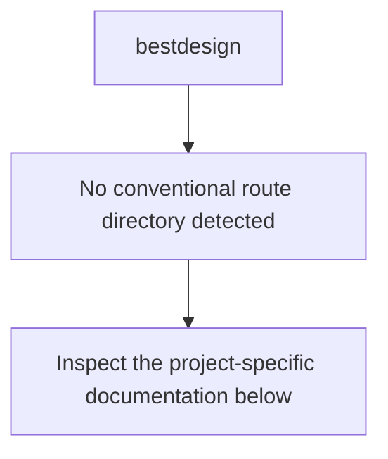
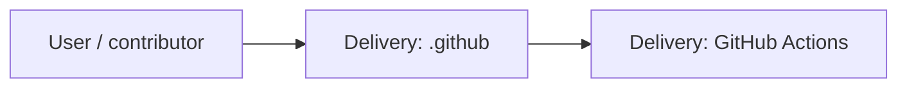
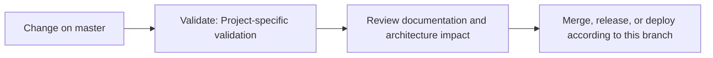

```mermaid
flowchart TD
    ROOT["bestdesign / master"]
    ROOT --> P0[".github/"]
    ROOT --> P1["css/"]
    ROOT --> P2["icons/"]
    ROOT --> P3["images/"]
    ROOT --> P4["js/"]
    ROOT --> P5["owl carousel/"]
    ROOT --> P6["category-work.php"]
    ROOT --> P7["footer.php"]
    ROOT --> P8["front-page.php"]
    ROOT --> P9["functions.php"]
    ROOT --> P10["header.php"]
    ROOT --> P11["index.php"]
    ROOT --> P12["page-about-us.php"]
    ROOT --> P13["page-contact-us111.php"]
    ROOT --> P14["page-our-services.php"]
    ROOT --> P15["page-our-work.php"]
    ROOT --> P16["page.php"]
    ROOT --> P17["single.php"]
    ROOT --> MORE["+ 2 more top-level entries"]
```

# Best Design Furniture WordPress Theme

<!-- interactive-readme-standard:start -->

> [!NOTE]
> **Branch-specific documentation:** this section is maintained for [`master`](https://github.com/Nischhalsubba/bestdesign/tree/master). It is generated from the files present on this branch and preserves the project-authored README below.

<details open>
<summary><strong>Interactive repository guide</strong></summary>

## Branch overview

| Item | Value |
|---|---|
| Repository | [`Nischhalsubba/bestdesign`](https://github.com/Nischhalsubba/bestdesign) |
| Branch | [`master`](https://github.com/Nischhalsubba/bestdesign/tree/master) |
| Detected stack | WordPress, PHP, CSS, JavaScript |
| Detected manifests | No standard manifest detected |
| Documentation policy | Every maintained branch must explain purpose, setup, structure, architecture, flows, testing, delivery, security, and ownership. |

## Repository structure



The diagram is generated from the branch's actual top-level files and directories. Use the branch link above for complete source navigation.

## Website or application structure



## Application and responsibility flow



## Change-to-delivery flow



## README requirements for this branch

- Explain what this branch contains and how it differs from the default branch.
- Keep installation, configuration, usage, testing, deployment, security, support, and license information accurate.
- Document repository, website or application, API, data, authentication, background-job, and deployment flows when they exist.
- Prefer Mermaid diagrams and expandable `<details>` sections for visual navigation.
- Link diagrams and modules to real source paths; never invent missing components.
- Preserve project-specific documentation and update diagrams whenever architecture or major paths change.
- Treat secrets, private infrastructure, customer data, and credentials as prohibited README content.

</details>

<!-- interactive-readme-standard:end -->

A custom WordPress theme created for Best Design Furniture and developed by Nischhal Raj Subba.

## What this repository contains

- WordPress theme templates written in PHP
- Custom furniture-brand layout and styling
- Theme images and branding assets
- WordPress navigation integration
- Responsive frontend behavior

This is not a standalone static HTML website. It must be installed inside a WordPress site's `wp-content/themes/` directory and activated from the WordPress admin area.

## Local setup

1. Install a local WordPress environment.
2. Copy this repository into:

```text
wp-content/themes/bestdesign
```

3. Activate the theme from **Appearance → Themes**.
4. Create or assign the navigation menu expected by the theme.
5. Configure pages, media, and content from WordPress.

## Main files

| File | Purpose |
|---|---|
| `style.css` | Theme metadata and main styles |
| `functions.php` | Theme setup and WordPress integrations |
| `header.php` | Document head, site branding, and navigation |
| `footer.php` | Footer markup and WordPress footer hook |
| `index.php` | Main fallback template |
| `front-page.php` | Homepage template when configured |

## Maintenance notes

- Use WordPress URL helpers rather than hard-coded `.html` links.
- Escape URLs and dynamic output with WordPress escaping functions.
- Preserve `wp_head()`, `wp_body_open()`, and `wp_footer()` hooks.
- Test menus, widgets, images, and templates against a supported WordPress version.
- Optimize large furniture images before production use.

## Status

This is an older custom-theme project retained as part of Nischhal's frontend and WordPress development history. It may require modernization before use on a current production website.

## Author

**Nischhal Raj Subba**

Current portfolio: https://nischhalsubba.com.np/
