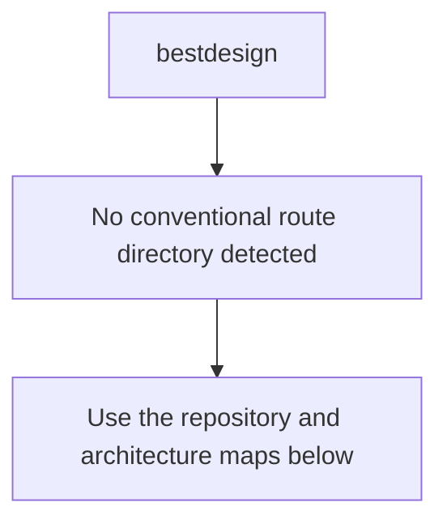
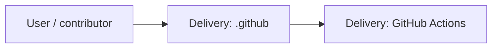
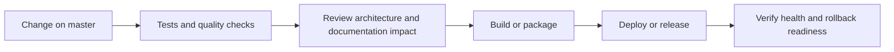
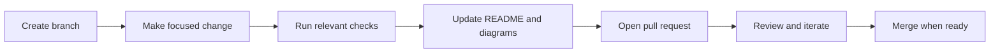

<!-- interactive-readme-standard:start -->

<div align="center">

# bestdesign

**Branch-aware technical guide for [`master`](https://github.com/Nischhalsubba/bestdesign/tree/master)**

<p>     </p>

<p>
  <a href="https://github.com/Nischhalsubba/bestdesign/tree/master"><strong>Browse source</strong></a> ·
  <a href="https://github.com/Nischhalsubba/bestdesign/issues"><strong>Issues</strong></a> ·
  <a href="https://github.com/Nischhalsubba/bestdesign/codespaces/new?ref=master"><strong>Open in Codespaces</strong></a>
</p>

</div>

> [!IMPORTANT]
> This guide is generated from the files actually present on `master`. It links to detected source paths, preserves project-authored notes, and avoids claiming components that were not found.

## At a glance

| Item | Detected value |
|---|---|
| Purpose | A WordPress project documented from the current branch structure and manifests. |
| Branch role | Default branch |
| Stack | WordPress, PHP, CSS, JavaScript |
| Manifests | No standard manifest detected |
| Prerequisites | Confirm from the detected manifests |
| Delivery | GitHub Actions |
| License | No license file detected |

## Branch scope

This is the repository's default branch.


## Quick start

> No reliable setup command was detected. Use the preserved project-authored notes and manifests rather than guessing.

### Configuration surface

- No committed environment example file was detected.

> Never commit secrets, private keys, production credentials, customer data, or unredacted infrastructure details.

## Repository map

```mermaid
flowchart TD
    ROOT["bestdesign / master"]
    ROOT --> P0[".github/"]
    ROOT --> P1["css/"]
    ROOT --> P2["icons/"]
    ROOT --> P3["images/"]
    ROOT --> P4["js/"]
    ROOT --> P5["owl carousel/"]
    ROOT --> P6["category-work.php"]
    ROOT --> P7["footer.php"]
    ROOT --> P8["front-page.php"]
    ROOT --> P9["functions.php"]
    ROOT --> P10["header.php"]
    ROOT --> P11["index.php"]
    ROOT --> P12["page-about-us.php"]
    ROOT --> P13["page-contact-us111.php"]
    ROOT --> P14["page-our-services.php"]
    ROOT --> P15["page-our-work.php"]
    ROOT --> P16["page.php"]
    ROOT --> P17["single.php"]
    ROOT --> MORE["+ 2 more top-level entries"]
```



| Responsibility | Detected source paths |
|---|---|
| Delivery | [`.github`](https://github.com/Nischhalsubba/bestdesign/tree/master/.github) |

## Website or application map



## Architecture and responsibility flow




## Quality, security, and operations

<table>
<tr>
<td width="33%" valign="top">

### Quality

- No conventional test directory was detected automatically.

Detected commands:
- No standard quality command detected.

</td>
<td width="33%" valign="top">

### Security

- No dedicated security policy or automated dependency configuration was detected.

Review authentication, authorization, input validation, dependency updates, secret handling, and failure recovery before release.

</td>
<td width="34%" valign="top">

### Observability

- No dedicated observability integration was detected automatically.

Define useful logs, metrics, traces, alerts, and rollback signals for production-facing branches.

</td>
</tr>
</table>

## Delivery flow



### Automation detected

- [`.github/workflows/apply-interactive-readme.yml`](https://github.com/Nischhalsubba/bestdesign/blob/master/.github/workflows/apply-interactive-readme.yml)

## Contribution flow



- Keep changes focused and explain architectural consequences.
- Run the checks relevant to the changed area.
- Update diagrams whenever routes, modules, data models, authentication, jobs, or delivery paths change.
- Add screenshots or recordings for visual behavior changes when useful.
- Use issues for reproducible defects and pull requests for reviewable changes.

## Ownership and support

| Topic | Source |
|---|---|
| Repository | [`Nischhalsubba/bestdesign`](https://github.com/Nischhalsubba/bestdesign) |
| Branch | [`master`](https://github.com/Nischhalsubba/bestdesign/tree/master) |
| Ownership | No CODEOWNERS file detected |
| Contributing | Use the contribution flow above |
| Support | [Open or review issues](https://github.com/Nischhalsubba/bestdesign/issues) |
| License | No license file detected |

<details>
<summary><strong>Documentation maintenance checklist</strong></summary>

- [ ] Purpose and branch scope are accurate.
- [ ] Setup and configuration commands still work.
- [ ] Repository, application, API, data, authentication, job, and deployment diagrams match the code.
- [ ] Tests, security controls, observability, and rollback behavior are documented.
- [ ] Links point to real files on this branch.
- [ ] No secrets or private operational details are exposed.

</details>

<!-- interactive-readme-standard:end -->

<!-- project-authored-notes:start -->
<details>
<summary><strong>Project-authored notes preserved from this branch</strong></summary>

# Best Design Furniture WordPress Theme

A custom WordPress theme created for Best Design Furniture and developed by Nischhal Raj Subba.

## What this repository contains

- WordPress theme templates written in PHP
- Custom furniture-brand layout and styling
- Theme images and branding assets
- WordPress navigation integration
- Responsive frontend behavior

This is not a standalone static HTML website. It must be installed inside a WordPress site's `wp-content/themes/` directory and activated from the WordPress admin area.

## Local setup

1. Install a local WordPress environment.
2. Copy this repository into:

```text
wp-content/themes/bestdesign
```

3. Activate the theme from **Appearance → Themes**.
4. Create or assign the navigation menu expected by the theme.
5. Configure pages, media, and content from WordPress.

## Main files

| File | Purpose |
|---|---|
| `style.css` | Theme metadata and main styles |
| `functions.php` | Theme setup and WordPress integrations |
| `header.php` | Document head, site branding, and navigation |
| `footer.php` | Footer markup and WordPress footer hook |
| `index.php` | Main fallback template |
| `front-page.php` | Homepage template when configured |

## Maintenance notes

- Use WordPress URL helpers rather than hard-coded `.html` links.
- Escape URLs and dynamic output with WordPress escaping functions.
- Preserve `wp_head()`, `wp_body_open()`, and `wp_footer()` hooks.
- Test menus, widgets, images, and templates against a supported WordPress version.
- Optimize large furniture images before production use.

## Status

This is an older custom-theme project retained as part of Nischhal's frontend and WordPress development history. It may require modernization before use on a current production website.

## Author

**Nischhal Raj Subba**

Current portfolio: https://nischhalsubba.com.np/

</details>
<!-- project-authored-notes:end -->
